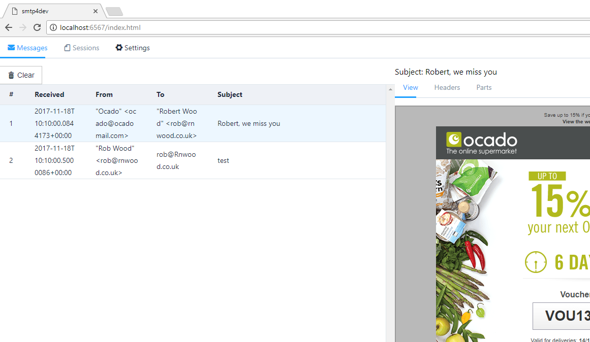
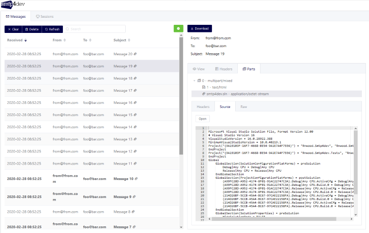

# smtp4dev
smtp4dev - the mail server for development

A dummy SMTP server for Windows, Linux, Mac OS-X (and maybe elsewhere where .NET Core is available). This repository hosts the development of v3 which will have a re-written web UI so that it can be shared amongst members of a team (the most requested feature in v2).
For the stable smtp4dev version 2 (Windows only desktop app) please see [https://github.com/rnwood/smtp4dev/releases/tag/v2.0.10] and the v2.0 branch.

*If you find smtp4dev useful, please consider supporting further development by making a donation:*

<a href='https://www.paypal.me/rnwood'></a>

[](https://ci.appveyor.com/project/rnwood/smtp4dev/branch/master)
[](https://github.com/rnwood/smtp4dev/releases) (+270k when prev hosted on Codeplex)

## Screenshots




## How to run smtp4dev

The version hosted on this repo is in heavy development. **Grab the [stable(r) v2 version](https://github.com/rnwood/smtp4dev/releases/tag/v2.0.10) if you want something feature complete which you can just double click on and use.**

*The MacOS release is totally untested. Please contribute instructions on how to use and feedback on any issues*

- Download [a release](https://github.com/rnwood/smtp4dev/releases) and unzip.

- On Linux `chmod +x` the `Rnwood.Smtp4dev` file to make it executable

- Edit ``appsettings.json`` and set the port number you want the SMTP server to listen on.

- Run `Rnwood.Smtp4dev` (`.exe` on Windows). (If you downloaded the ``noruntime`` version, you need the .NET Core 2.0 runtime on your machine and you should execute ``dotnet Rnwood.Smtpdev.dll`` to run it.)

- Open your browser at `http://localhost:5000` (to run the web server on a different port or make it listen on interfaces other than loopback, add the command line arg `--server.urls "http://0.0.0.0:5001/"` when starting the executable.

- Now configure your apps which send mail, to use the SMTP server on the machine where SMTP4dev is running (``localhost`` if they are on the same machine), and using the port you selected (``25`` by default).

## How to run smtp4dev in Docker
A Docker (Linux host) image is available. To run with the web interface on port 3000 and SMTP on port 25:

```
docker run -p 3000:80 -p 25:25 rnwood/smtp4dev
```

## How to run smtp4dev as a service (Windows only)

A service in Windows can be installed using New-Service in PowerShell, or sc in both command line or PowerShell. If you use sc in PowerShell, it must be run as sc.exe. sc is an alias for Set-Content.

### Install service in PowerShell

```
New-Service -Name Smtp4dev -BinaryPathName "{PathToExe} --service"
```

### Install service in Cmd or PowerShell

```
sc.exe create Smtp4dev binPath= "{PathToExe} --service"
```
