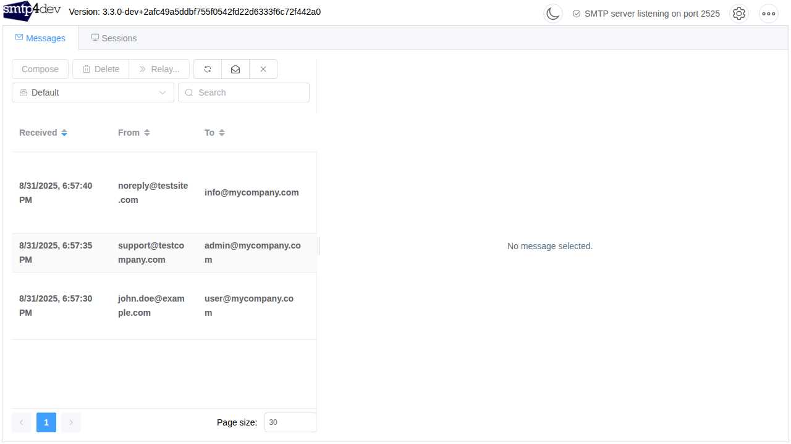
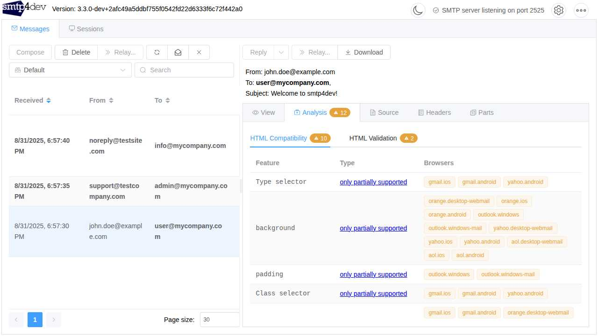
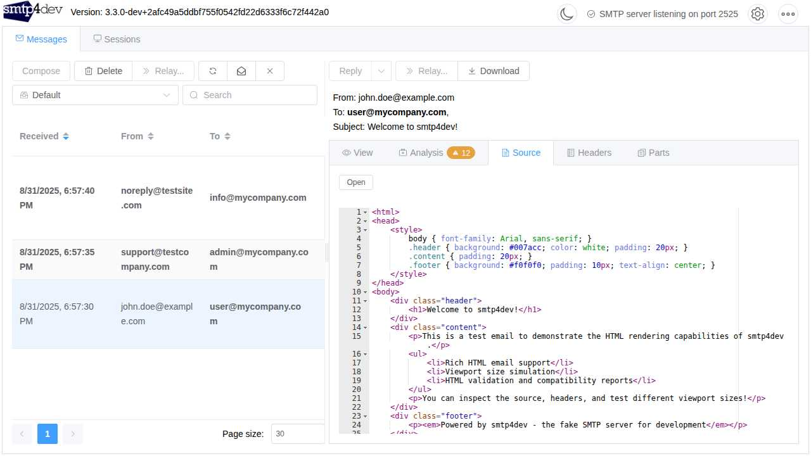
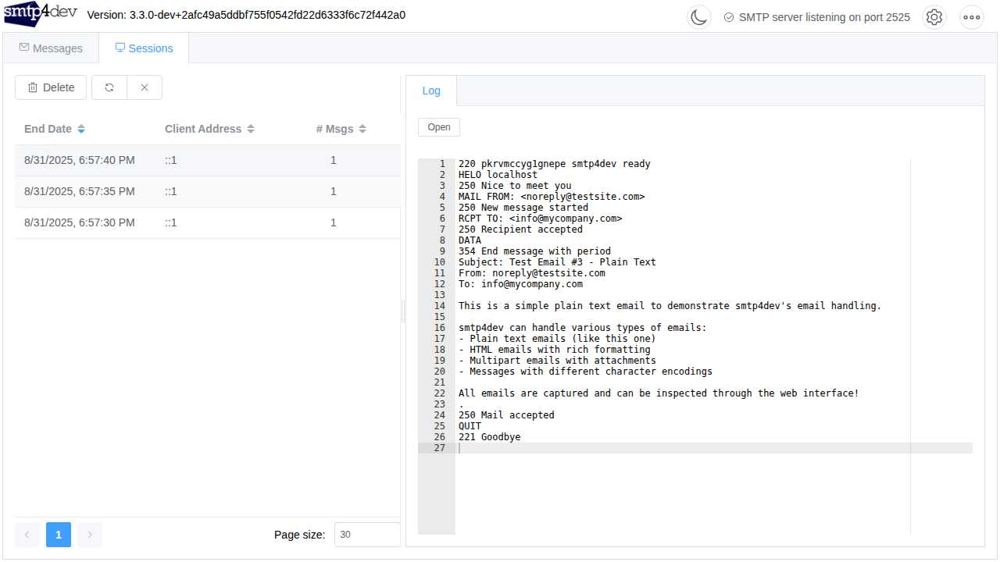
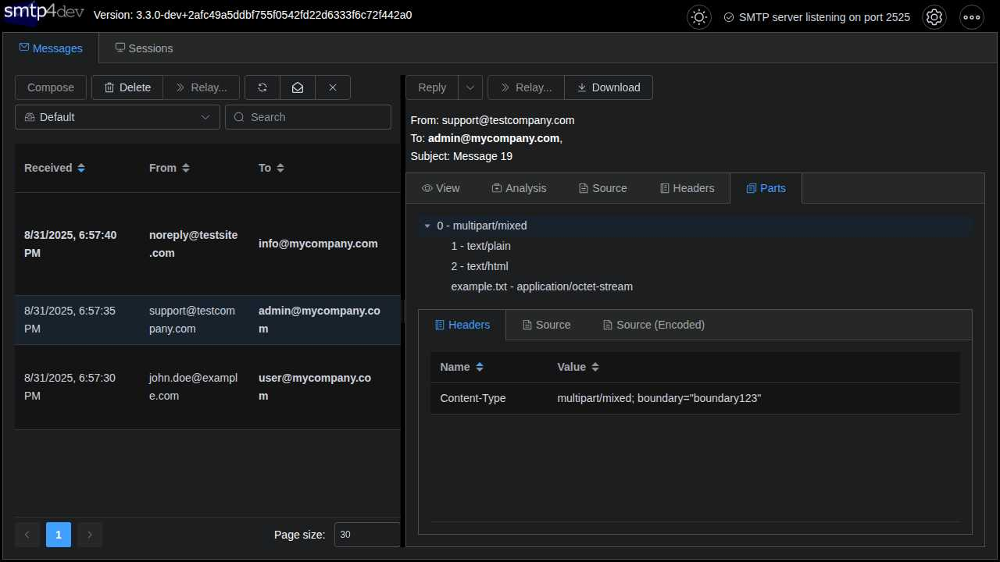
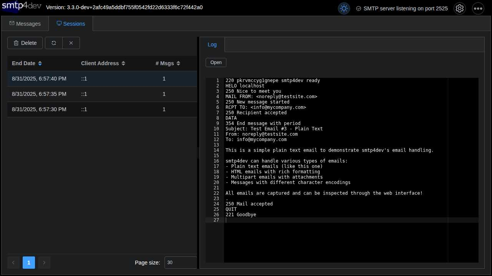

# 
**smtp4dev - the fake SMTP email server for development and testing.**

A dummy SMTP server for Windows, Linux, Mac OS-X (and maybe elsewhere where .NET Core is available). Lets you test your application without spamming your real customers.

smtp4dev support many advanced features:
- OpenAPI/Swagger API
- IMAP access to retrieve and delete messages
- SMTP session logging
- UTF8 support
- Viewport size switcher to simulate mobile etc
- Multipart MIME inspector
- HTML compatibility report and HTML validation
- TLS/SSL with implicit and STARTTLS modes and auto self-signed cert generation
- Authentication
- Multiple mailboxes along with rules to control what message goes where
- Reply, compose and relay messages including rules to auto relay
- Scripting expressions including error simulation

*If you're looking for the older v2 Windows only GUI version. [Grab it here](https://github.com/rnwood/smtp4dev/releases/tag/v2.0.10).*

>   *If you find smtp4dev useful, please consider supporting further development by making a donation*
> .

## Getting Started
[Installation Instructions](docs/Installation.md)

[Configuration](docs/Configuration.md)

[Configuring your programs to send mails to smtp4dev](docs/Configuring-Clients.md)

[API](docs/API.md)

[📚 **View Full Documentation**](docs/README.md)

## Security
**⚠️ Docker Users**: Please read [Docker Security Guidelines](docs/Docker-Security.md) to prevent accidental public exposure of your smtp4dev instance to the world!

## Screenshots

### Main Message Interface
The main interface showing received emails with sender, recipient, subject, and timestamps.

### HTML Email Rendering & Viewport Simulation
View HTML emails with rich formatting, including viewport size simulation for testing responsive email designs.

### HTML Compatibility Analysis
Comprehensive email client compatibility reports showing which HTML/CSS features are supported across different email clients.

### Message Source & Raw Content
Inspect the raw message source with syntax highlighting and line numbers for debugging.

### SMTP Session Logging
View detailed SMTP session logs to debug email delivery issues and protocol interactions.

### MIME Parts Inspector
Analyze multipart emails with attachments using the built-in MIME inspector.

### Dark Mode Support
Full dark mode support for comfortable viewing in low-light environments.

## License

