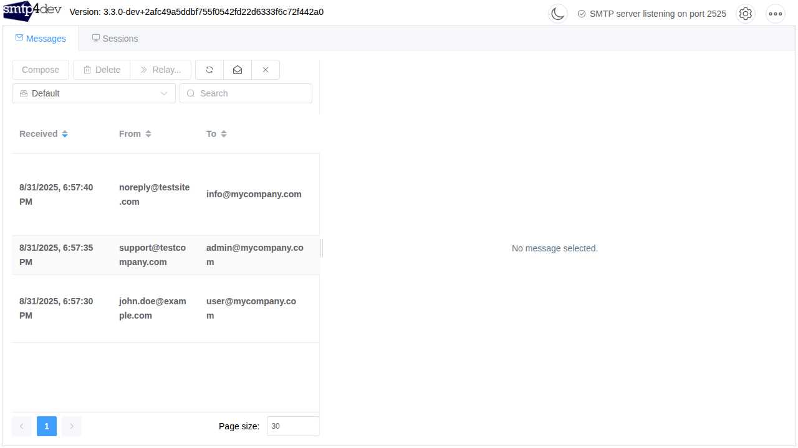
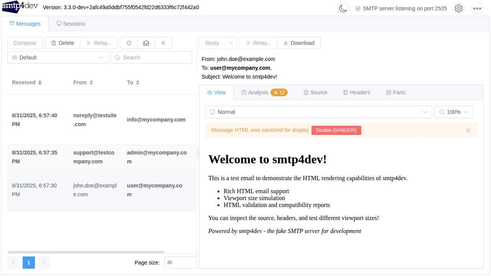
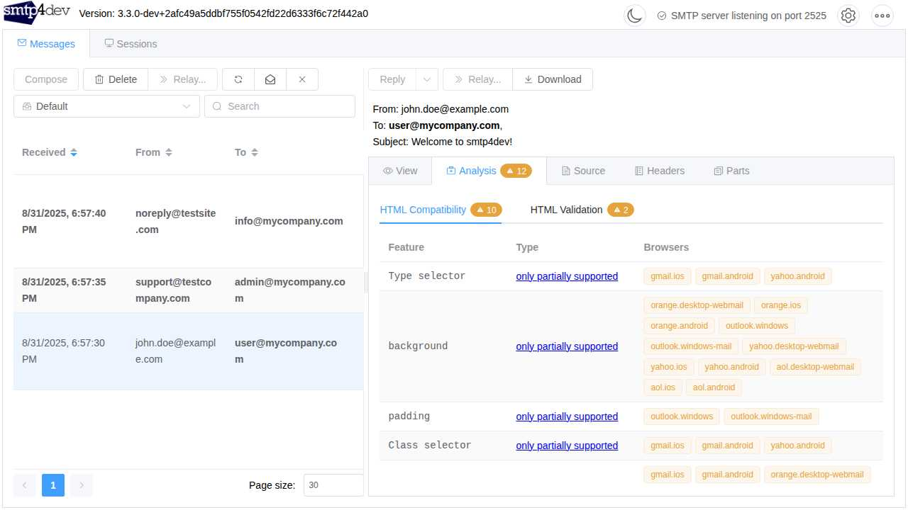
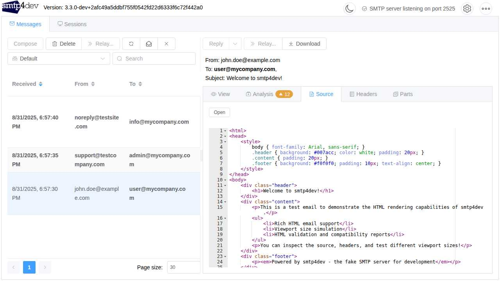
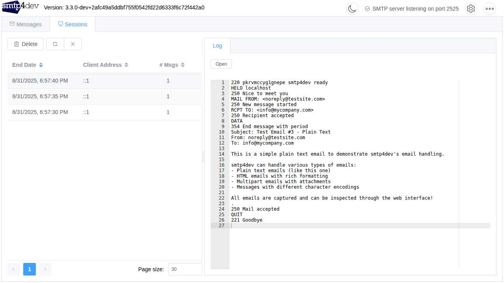
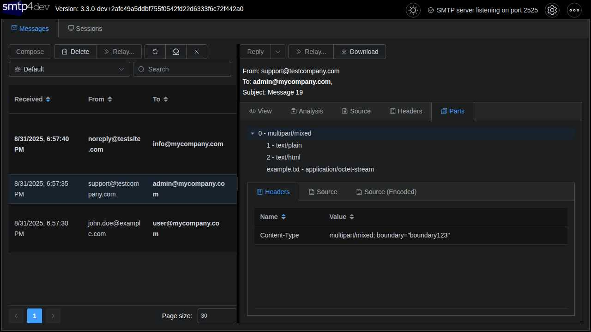
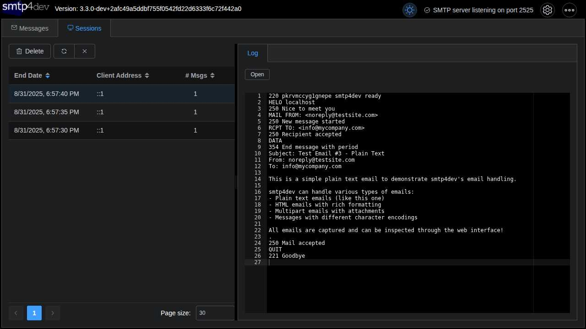

# 
**smtp4dev - the fake SMTP email server for development and testing.**

A dummy SMTP server for Windows, Linux, Mac OS-X (and maybe elsewhere where .NET Core is available). Lets you test your application without spamming your real customers.

smtp4dev support many advanced features:
- OpenAPI/Swagger API
- IMAP and POP3 access to retrieve and delete messages
- SMTP session logging
- **Terminal User Interface (TUI) mode with full functionality**
- UTF8 support
- Viewport size switcher to simulate mobile etc
- Multipart MIME inspector
- HTML compatibility report and HTML validation
- TLS/SSL with implicit and STARTTLS modes and auto self-signed cert generation
- Authentication
- Multiple mailboxes along with rules to control what message goes where
- Reply, compose and relay messages including rules to auto relay
- Scripting expressions including error simulation

*If you're looking for the older v2 Windows only GUI version. [Grab it here](https://github.com/rnwood/smtp4dev/releases/tag/v2.0.10).*

## How smtp4dev Compares

There are several fake SMTP servers available for development and testing. Here's how smtp4dev stacks up against other popular options:

| Feature | smtp4dev | MailHog¹ | MailCatcher² | MailDev³ | FakeSMTP⁴ |
|---------|----------|----------|-------------|---------|-----------|
| **Web Interface** | ✅ Advanced | ✅ Basic | ✅ Basic | ✅ Basic | ❌ Desktop GUI |
| **Terminal UI (TUI)** | ✅ Full-featured | ❌ | ❌ | ❌ | ❌ |
| **SMTP Server** | ✅ | ✅ | ✅ | ✅ | ✅ |
| **IMAP Server** | ✅ | ❌ | ❌ | ❌ | ❌ |
| **API (REST/OpenAPI)** | ✅ Swagger docs | ✅ Basic⁵ | ✅ RESTful⁶ | ✅ Basic⁷ | ❌ |
| **HTML Email Rendering** | ✅ Advanced | ✅ Basic | ✅ Basic | ✅ Basic | ❌ |
| **HTML Compatibility Reports** | ✅ | ❌ | ❌ | ❌ | ❌ |
| **Responsive Email Testing** | ✅ Viewport switcher | ❌ | ❌ | ✅ Resizable⁸ | ❌ |
| **MIME Parts Inspector** | ✅ | ❌ | ❌ | ❌ | ❌ |
| **SMTP Session Logging** | ✅ Detailed | ❌ | ❌ | ❌ | ❌ |
| **TLS/SSL Support** | ✅ Auto-cert generation | ❌ | ❌ | ✅ Basic⁹ | ❌ |
| **Authentication** | ✅ | ✅ Basic¹⁰ | ❌ | ✅ Basic¹¹ | ❌ |
| **Multiple Mailboxes** | ✅ With rules | ❌ | ❌ | ❌ | ❌ |
| **Message Relay** | ✅ With rules | ✅ Basic¹² | ❌ | ✅ Basic¹³ | ❌ |
| **Message Composition** | ✅ | ❌ | ❌ | ❌ | ❌ |
| **Scripting & Error Simulation** | ✅ | ✅ Limited¹⁴ | ❌ | ❌ | ❌ |
| **Dark Mode** | ✅ | ❌ | ❌ | ❌ | ❌ |
| **Cross-Platform** | ✅ .NET 10 | ✅ Go | ✅ Ruby | ✅ Node.js | ✅ Java |
| **Docker Support** | ✅ | ✅ | ✅ | ✅ | ❌ |

### Sources

1. [MailHog GitHub Repository](https://github.com/mailhog/MailHog) - Features verified from official documentation
2. [MailCatcher GitHub Repository](https://github.com/sj26/mailcatcher) - Features verified from official documentation  
3. [MailDev GitHub Repository](https://github.com/maildev/maildev) - Features verified from official documentation
4. [FakeSMTP GitHub Repository](https://github.com/Nilhcem/FakeSMTP) - Features verified from official documentation
5. MailHog API: [APIv1](https://github.com/mailhog/MailHog/blob/master/docs/APIv1.md) and [APIv2](https://github.com/mailhog/MailHog/blob/master/docs/APIv2.md) documentation
6. MailCatcher API: RESTful URLs documented in [README](https://github.com/sj26/mailcatcher#api) but no formal API documentation
7. MailDev API: [REST API documentation](https://github.com/maildev/maildev/blob/master/docs/rest.md)
8. MailDev responsive testing: ["Test responsive emails with resizable preview pane"](https://github.com/maildev/maildev#features)
9. MailDev TLS/SSL: [SSL options documented](https://github.com/maildev/maildev#usage) (`--incoming-secure`, `--incoming-cert`, `--incoming-key`)
10. MailHog authentication: [HTTP basic authentication](https://github.com/mailhog/MailHog/blob/master/docs/Auth.md) for UI and API
11. MailDev authentication: [Authentication options](https://github.com/maildev/maildev#usage) (`--incoming-user/pass`, `--web-user/pass`)
12. MailHog relay: ["Release messages to real SMTP servers"](https://github.com/mailhog/MailHog#features)
13. MailDev relay: ["Ability to relay email to an upstream SMTP server"](https://github.com/maildev/maildev#features) with auto-relay mode
14. MailHog scripting: [Chaos Monkey for failure testing](https://github.com/mailhog/MailHog/blob/master/docs/JIM.md)

### Why Choose smtp4dev?

**For Advanced Development & Testing**: If you need comprehensive email testing capabilities, smtp4dev offers features not found in other tools like HTML compatibility analysis, responsive design testing, and detailed SMTP session logging.

**For Production-Like Testing**: With IMAP support, TLS/SSL, authentication, and multiple mailboxes, smtp4dev can simulate real email server behavior more accurately.

**For Team Workflows**: The advanced web interface, API documentation, and message relay capabilities make smtp4dev ideal for development teams and CI/CD pipelines.

**For Modern Email Development**: Responsive email testing, HTML validation, and compatibility reports help ensure your emails work across all clients and devices.

>   *If you find smtp4dev useful, please consider supporting further development by making a donation*
> .

## Getting Started
[Installation Instructions](docs/Installation.md)

[Configuration](docs/Configuration.md)

[Configuring your programs to send mails to smtp4dev](docs/Configuring-Clients.md)

[API](docs/API.md)

[📚 **View Full Documentation**](docs/README.md)

## Security
**⚠️ Docker Users**: Please read [Docker Security Guidelines](docs/Docker-Security.md) to prevent accidental public exposure of your smtp4dev instance to the world!

## Screenshots

### Main Message Interface
The main interface showing received emails with sender, recipient, subject, and timestamps.

### HTML Email Rendering & Viewport Simulation
View HTML emails with rich formatting, including viewport size simulation for testing responsive email designs.

### HTML Compatibility Analysis
Comprehensive email client compatibility reports showing which HTML/CSS features are supported across different email clients.

### Message Source & Raw Content
Inspect the raw message source with syntax highlighting and line numbers for debugging.

### SMTP Session Logging
View detailed SMTP session logs to debug email delivery issues and protocol interactions.

### MIME Parts Inspector
Analyze multipart emails with attachments using the built-in MIME inspector.

### Dark Mode Support
Full dark mode support for comfortable viewing in low-light environments.

## Contributing

We welcome contributions! Before submitting a pull request, please:

1. Read our [Contributing Guide](CONTRIBUTING.md)
2. Sign the [Contributor License Agreement](CLA.md)

## License

